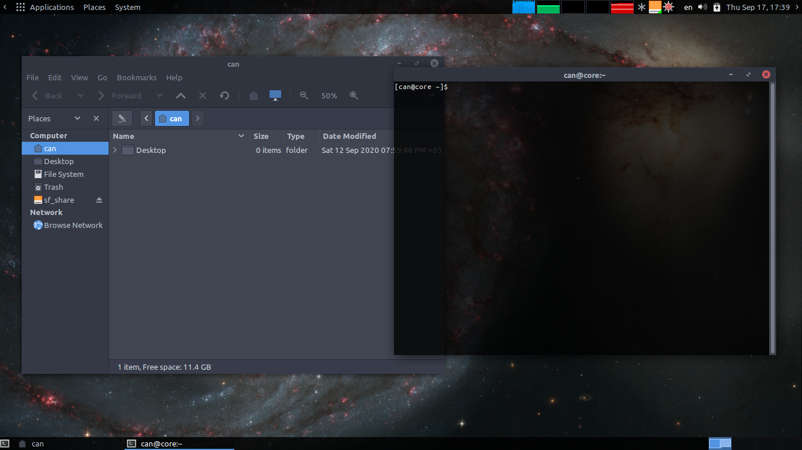

# Arch Linux Mate Setup <!-- omit in toc -->

---



---

# Table of Contents <!-- omit in toc -->

- [Installing Arch Linux](#installing-arch-linux)
  - [Arch install script (Legacy bios)](#arch-install-script-legacy-bios)
  - [Install script](#install-script)
- [Setup](#setup)
  - [Desktop Environment](#desktop-environment)
    - [Mate](#mate)
      - [Panel](#panel)
  - [Terminal](#terminal)
    - [Mate-Terminal](#mate-terminal)
    - [Zsh](#zsh)
  - [Web  Browsers](#web-browsers)
    - [Firefox](#firefox)
    - [Chromium](#chromium)
  - [Text Editors](#text-editors)
    - [Emacs](#emacs)
    - [Vscode](#vscode)
  - [Document Viewer/Editor](#document-viewereditor)
    - [Zathura](#zathura)
    - [Master PDF Editor](#master-pdf-editor)
    - [Libreoffice](#libreoffice)
  - [Video/Audio Players](#videoaudio-players)
    - [Mpv](#mpv)
    - [Rhythmbox](#rhythmbox)

---

# Installing Arch Linux

Preferably arch linux must be installed via [Arch wiki installation guide](https://wiki.archlinux.org/index.php/installation_guide). But I created an script for arch installation because while testing out this rice on WMs it needs to be installed quickly.

## Arch install script (Legacy bios)

Before running arch install script partitions must be prepared. Partitions can be created via **cfdisk** command.

- cfdisk
  - dos
    1. [Partition 1], 14GB (Assuming 16GB storage), bootable
    2. [Partition 2 (for swap)], 2GB, [Type] > 82 Linux swap/Solaris
    3. [Write] > yes
    4. [Quit]

After creating partitions, mate and other essentials can be install via script:

```sh
sh -c "$(curl -fsSL https://git.io/JJ8Dm)"
```

**NOTE**: User passwords in script are chosen as simple it can be because of this is not an proper installation. Must be change after install.

## Install script

```sh
sh -c "$(curl -fsSL https://git.io/JJw2i)"
```

# Setup

## Desktop Environment

### Mate

#### Panel

## Terminal

### Mate-Terminal

### Zsh

## Web  Browsers

### Firefox

### Chromium

## Text Editors

### Emacs

### Vscode

## Document Viewer/Editor

### Zathura

### Master PDF Editor

### Libreoffice

## Video/Audio Players

### Mpv

### Rhythmbox
